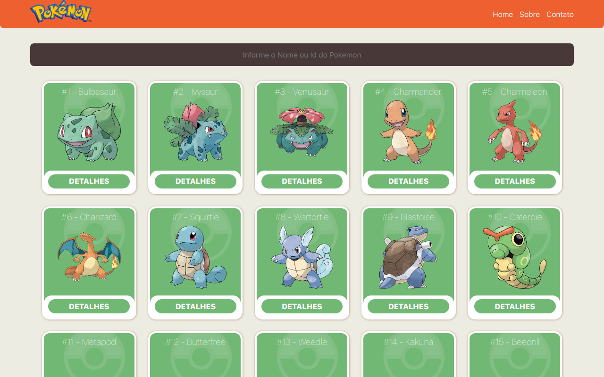

# 📖 Pokedex-VueJS

Tenha as informações dos primeiros 151 pokemons.

#
## 🕵 Sobre
A Pokedex-VueJS é uma aplicação web da Pokedex com informações dos pokemons consumindo a API [PokeAPi](https://pokeapi.co/), que possui informações detalhadas de todos os pokemons existentes.
#
## 👤Autores
- Daniel Emidio
#
## 🧭 Status do Projeto
- ⌛Em andamento: (Detalhes do Pokemon)
- ⌛Concluído: (Consumir API, Renderizar Pokemons, Responsividade, Filtro por Nome ou Id, página sobre o projeto, página de contato)
#
## 🎯 Objetivo do Projeto
Este é um projeto desenvolvido no processo seletivo da Copybase, cujo o principal objetivo é criar uma Pokedex utilizando VueJs.

## 💻 Tecnologias 

#
## 🛰 Funcionalidades

- Página Inicial: Ao carregar a aplicação, você será redirecionado a página inicial do projeto, que exibirá todos os 151 pokemons da Pokedex;
- Filtrar Pokemon: Na página inicial, no campo de texto, você poderá realizar a busca do pokemon desejado informando seu nome ou seu número na pokedex (id);
- Detalhes Pokemon: Ao clicar no botão de "Detalhes" no Card de Pokemon, você receberá suas informações detalhadas;
#
## 🔗 Link para acessar
- Link do Vercel: [clique aqui!](https://pokedex-vuejs-orpin.vercel.app/)
#
## ⚒️ Livrarias Utilizadas

- npm install axios
- npm install vue-router
#

## 📫 Contato

E-mail: emidio.daniel@hotmail.com

